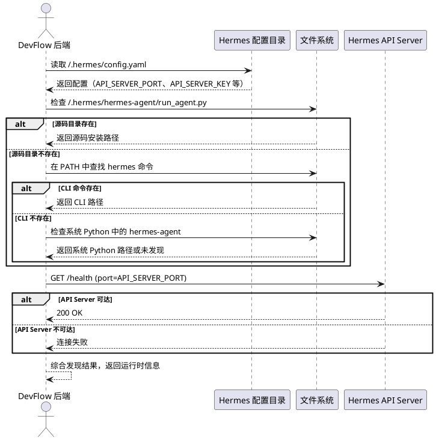
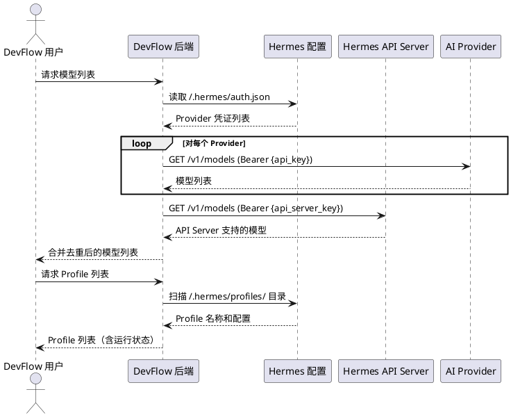
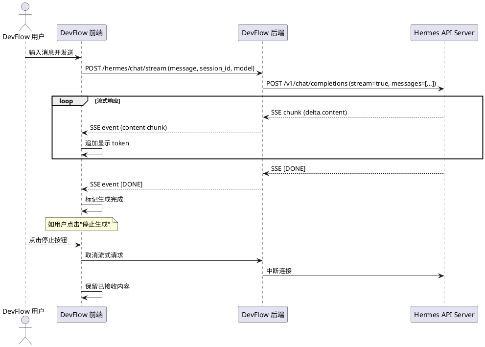
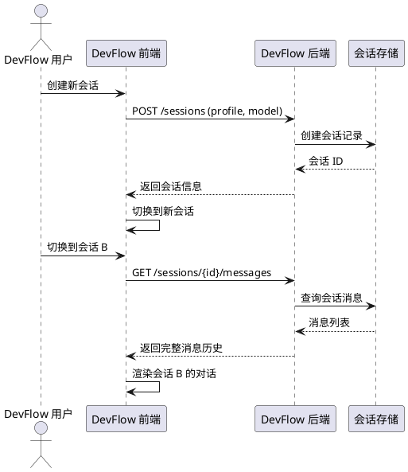
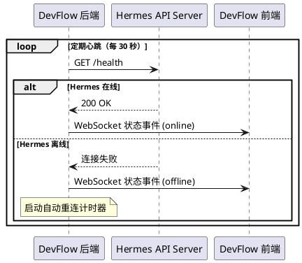

# Hermes Agent 发现、对接、对话集成 — 需求规格

# **1. 组件定位**

## **1.1 核心职责**

本组件负责发现、对接宿主机上运行的 Hermes Agent 运行时，并通过 OpenAI 兼容 API 或 Socket.IO 实现流式智能对话，实现 DevFlow 与 Hermes 的深度集成。

## **1.2 核心输入**

1. **Hermes 配置目录**（`~/.hermes/`）：包含 `config.yaml`、`auth.json`、`.env` 等运行时配置文件
2. **Hermes Agent 源码安装路径**：包含 `run_agent.py` 的目录（如 `~/.hermes/hermes-agent`）
3. **用户对话请求**：用户通过 DevFlow 前端发起的聊天消息、会话管理指令
4. **Hermes API Server 健康状态**：`/health`、`/v1/models` 端点响应
5. **环境变量**：`HERMES_API_BASE`、`HERMES_API_KEY`、`HERMES_PROFILES_PATH` 等

## **1.3 核心输出**

1. **Hermes 运行时发现结果**：检测到的 Hermes Agent 安装位置、运行状态、可用连接方式
2. **模型列表**：从凭证池和 Provider 端点获取的可用 AI 模型列表
3. **流式对话响应**：通过 SSE 或 WebSocket 推送到前端的实时聊天内容流
4. **会话状态变更通知**：会话创建、切换、删除等操作的结果
5. **Profile 管理结果**：配置文件创建、切换、删除的操作结果

## **1.4 职责边界**

1. 本组件**不负责**直接运行或启动 Hermes Agent 进程（由用户在宿主机上管理）
2. 本组件**不负责**管理 LLM API 密钥的生成（仅读取和使用）
3. 本组件**不负责**实现 AI 模型推理逻辑（完全委托给 Hermes Agent）
4. 本组件**不负责**替代 Hermes Web UI 的全部功能（仅集成 DevFlow 所需的对话和发现能力）
5. 本组件**不负责**直接修改 `auth.json` 中的凭证内容（仅读取用于模型发现）

# **2. 领域术语**

**Hermes Agent**
: 宿主机上运行的 AI 智能体运行时，提供 OpenAI 兼容的 API Server 和 Socket.IO 聊天能力。

**Hermes 运行时发现**
: 按优先级顺序检测 Hermes Agent 安装位置和可用连接方式的机制，包括源码目录、CLI 命令、系统 Python 三级回退。

**Hermes API Server**
: Hermes Agent 内置的 HTTP 服务，提供 OpenAI 兼容的 `/v1/chat/completions`、`/v1/models`、`/health` 端点。

**agent bridge**
: Hermes Web UI 中连接前端与 Hermes Agent 运行时的桥接层，通过 Socket.IO `/chat-run` 事件实现流式对话。

**凭证池（auth.json）**
: 位于 `~/.hermes/auth.json` 的文件，存储多个 AI Provider 的 API 密钥，用于模型发现和调用鉴权。

**Profile**
: Hermes 的命名配置文件，每个 Profile 拥有独立的 `config.yaml`，定义模型、渠道行为等设置。

**Socket.IO 流式对话**
: 通过 Socket.IO 协议的 `/chat-run` 事件实现的服务端推送式实时对话，支持逐 token/chunk 输出。

**SSE（Server-Sent Events）**
: 基于 HTTP 的服务端推送协议，DevFlow 后端向前端推送流式对话内容的方式。

**思考过程（Thinking Process）**
: AI 模型在生成正式回复前的内部推理过程，部分模型（如 DeepSeek）会输出 `<think>...</think>` 标签包裹的思考内容。

**工具调用（Tool Call）**
: AI 智能体在对话过程中调用的外部工具（如文件读写、命令执行），需在对话界面中展示调用过程和结果。

# **3. 角色与边界**

## **3.1 核心角色**

- **DevFlow 用户**：通过 DevFlow 前端界面与 Hermes Agent 进行对话交互的项目成员
- **DevFlow 系统管理员**：配置 Hermes 连接参数、管理 Profile 和凭证的管理人员

## **3.2 外部系统**

- **Hermes Agent 运行时**：宿主机上运行的 AI 智能体，提供 API Server 和 Socket.IO 端点
- **Hermes 配置文件系统**：`~/.hermes/` 目录下的 config.yaml、auth.json、.env 文件
- **AI Provider 端点**：OpenAI、DeepSeek、OpenRouter 等 LLM 服务商的 `/v1/models` 接口
- **Docker 网络层**：DevFlow 后端容器通过 `host.docker.internal` 访问宿主机 Hermes 服务

## **3.3 交互上下文**

```plantuml
@startuml
!define COMPONENT_COLOR #E3F2FD
!define EXTERNAL_COLOR #FFF8E1
!define USER_COLOR #E8F5E9

skinparam componentStyle rectangle
skinparam defaultFontSize 12

actor "DevFlow 用户" as user #USER_COLOR
actor "DevFlow 管理员" as admin #USER_COLOR

rectangle "DevFlow 前端\n(Vue3 + Element Plus)" as frontend #COMPONENT_COLOR {
}

rectangle "DevFlow 后端\n(FastAPI)" as backend #COMPONENT_COLOR {
}

rectangle "Hermes Agent\n(宿主机)" as hermes #EXTERNAL_COLOR {
}

rectangle "Hermes 配置\n(~/.hermes/)" as config #EXTERNAL_COLOR {
}

rectangle "AI Provider\n(OpenAI/DeepSeek/...)" as provider #EXTERNAL_COLOR {
}

user --> frontend : 发送对话消息
admin --> frontend : 配置连接/管理 Profile
frontend --> backend : HTTP/SSE 对话请求
backend --> hermes : OpenAI API (/v1/chat/completions)\nSocket.IO (/chat-run)
backend --> config : 读取 config.yaml / auth.json
hermes --> provider : 模型推理请求
hermes --> backend : 流式对话响应
backend --> frontend : SSE 流式推送

@enduml
```

# **4. DFX约束**

## **4.1 性能**

1. When 用户发送对话消息，the Hermes 集成模块 shall 在 3 秒内返回首个流式 token（首 token 延迟）
2. When Hermes API Server 不可达，the 发现模块 shall 在 5 秒内完成超时检测并回退到下一级发现策略
3. The 模型发现接口 shall 在 10 秒内返回所有可用模型列表
4. The 流式对话传输 shall 支持至少 5 个并发对话会话而不产生阻塞

## **4.2 可靠性**

1. When Hermes Agent 运行时在对话过程中重启，the 集成模块 shall 自动检测断连并在 30 秒内尝试重新建立连接
2. While Docker 容器与宿主机网络中断，the 集成模块 shall 将对话请求排队等待网络恢复，而非直接丢弃
3. The 流式对话内容 shall 在传输中断时保留已接收的部分内容，支持断点续传或显示已接收内容

## **4.3 安全性**

1. The 集成模块 shall 对 `auth.json` 中的 API 密钥仅作读取，禁止通过任何 API 端点暴露完整密钥内容
2. When 调用 Hermes API Server，the 集成模块 shall 使用配置中的 `API_SERVER_KEY` 进行鉴权
3. The 集成模块 shall 禁止将 `~/.hermes/.env` 中的敏感信息写入 DevFlow 日志

## **4.4 可维护性**

1. The 集成模块 shall 为每次对话请求记录结构化日志，包含请求 ID、Profile 名称、模型名称、耗时
2. The 发现模块 shall 在检测到 Hermes 安装异常时输出诊断信息，包含搜索路径、检测结果、失败原因
3. The 流式对话传输 shall 支持链路追踪，通过请求 ID 关联前端请求与后端调用

## **4.5 兼容性**

1. The 集成模块 shall 同时支持源码安装（`run_agent.py`）和 `pip install` 包安装两种 Hermes 安装方式
2. The 集成模块 shall 兼容 Docker 容器内访问（`host.docker.internal`）和本地直接访问（`localhost`）两种网络模式
3. Where Hermes API Server 未启用，the 集成模块 shall 回退到 CLI 模式进行对话（保持向后兼容）

# **5. 核心能力**

## **5.1 Hermes Agent 运行时发现**

### **5.1.1 业务规则**

1. **三级发现策略**：发现模块必须按以下优先级顺序检测 Hermes Agent 运行时，找到首个可用即停止
   a. 验收条件：[启动发现流程] → [依次检测：①源码目录中的 `run_agent.py` → ②已安装的 `hermes` CLI 命令 → ③系统 Python 中的 `hermes-agent` 包，找到首个可用结果即返回]

2. **源码目录检测**：发现模块必须优先在 `~/.hermes/hermes-agent` 目录中查找包含 `run_agent.py` 的源码安装
   a. 验收条件：[`~/.hermes/hermes-agent/run_agent.py` 文件存在] → [返回源码安装路径和 Python 解释器路径]

3. **CLI 命令检测**：当源码目录不存在时，发现模块必须在 PATH 中查找 `hermes` 命令
   a. 验收条件：[`hermes` 命令在 PATH 中可用] → [返回 CLI 命令路径及关联的 Python 环境]

4. **系统 Python 回退**：当源码目录和 CLI 命令均不可用时，发现模块必须在系统 Python 中查找 `hermes-agent` 包
   a. 验收条件：[前两级均失败且 `python -c "import hermes_agent"` 成功] → [返回系统 Python 路径和包安装信息]

5. **API Server 可用性检测**：发现模块必须检测 Hermes API Server 的 `/health` 端点是否可达
   a. 验收条件：[Hermes API Server 在 `API_SERVER_PORT` 上运行] → [`/health` 端点返回 200，标记 API Server 为可用]

6. **配置目录挂载检测**：当 DevFlow 运行在 Docker 容器中时，发现模块必须检测 Hermes 配置目录是否已挂载
   a. 验收条件：[Docker 容器中 `/hermes-home/config.yaml` 存在] → [使用挂载路径读取配置；否则通过 `host.docker.internal` 远程访问]

7. **禁止项**：发现模块禁止自动启动 Hermes Agent 进程
   a. 验收条件：[Hermes Agent 未运行] → [返回"未发现可用运行时"状态，而非尝试启动进程]

### **5.1.2 交互流程**



### **5.1.3 异常场景**

1. **所有发现策略均失败**
   a. 触发条件：源码目录、CLI 命令、系统 Python 均不可用
   b. 系统行为：记录详细诊断日志，标记 Hermes 状态为"未发现"
   c. 用户感知：前端显示"Hermes Agent 未安装或未运行"，提供安装指引链接

2. **API Server 端口被占用**
   a. 触发条件：`API_SERVER_PORT` 端口被非 Hermes 进程占用
   b. 系统行为：检测 `/health` 端点返回内容，判断是否为 Hermes 服务
   c. 用户感知：若非 Hermes 服务，提示"端口 {port} 被 非 Hermes 进程占用"

3. **配置目录权限不足**
   a. 触发条件：Docker 容器中 `/hermes-home` 挂载为只读且配置文件不存在
   b. 系统行为：回退到通过 `host.docker.internal` 远程访问 API Server
   c. 用户感知：前端显示"已切换到远程访问模式"

## **5.2 Hermes Agent 对接与模型发现**

### **5.2.1 业务规则**

1. **连接方式选择**：对接模块必须按以下优先级选择连接方式：①Hermes API Server（OpenAI 兼容）→ ②agent bridge（Socket.IO）→ ③CLI 命令回退
   a. 验收条件：[Hermes API Server 可用] → [使用 OpenAI 兼容 API 对接；API Server 不可用且 agent bridge 可用] → [使用 Socket.IO 对接；两者均不可用] → [使用 CLI 回退]

2. **凭证池读取**：对接模块必须从 `~/.hermes/auth.json` 读取所有 Provider 的凭证信息
   a. 验收条件：[`auth.json` 存在且包含至少一个 Provider 的凭证] → [解析并缓存所有 Provider 名称、API 密钥、Base URL]

3. **模型发现**：对接模块必须为每个有凭证的 Provider 调用 `/v1/models` 端点获取可用模型列表
   a. 验收条件：[Provider 凭证有效且端点可达] → [返回该 Provider 下所有可用模型的 ID、名称、Owned-by 信息]

4. **API Server 模型发现**：当 Hermes API Server 可用时，对接模块必须通过 `/v1/models` 端点获取 API Server 支持的模型列表
   a. 验收条件：[调用 `http://localhost:{port}/v1/models`] → [返回包含 `hermes-agent` 模型的列表]

5. **Profile 管理**：对接模块必须支持从 `~/.hermes/profiles/` 目录扫描、创建、切换、重命名、删除 Profile
   a. 验收条件：[用户执行 Profile 管理操作] → [操作结果持久化到文件系统，并同步更新 DevFlow 中的 Agent 记录]

6. **配置信息提取**：对接模块必须从每个 Profile 的 `config.yaml` 中提取模型配置、渠道行为设置、API Server 配置
   a. 验收条件：[读取 Profile 的 `config.yaml`] → [返回 model.default、model.provider、platforms.api_server 等结构化配置]

7. **禁止项**：对接模块禁止通过 DevFlow API 暴露 `auth.json` 中的完整 API 密钥
   a. 验收条件：[调用模型发现 API] → [返回的模型列表中不包含完整密钥，仅显示脱敏后的密钥前缀（如 `sk-...abc`）]

### **5.2.2 交互流程**



### **5.2.3 异常场景**

1. **auth.json 不存在或格式错误**
   a. 触发条件：`~/.hermes/auth.json` 文件缺失或 JSON 解析失败
   b. 系统行为：跳过凭证池读取，仅使用 Hermes API Server 的模型发现
   c. 用户感知：前端提示"凭证池不可用，仅显示 API Server 模型"

2. **Provider 端点超时**
   a. 触发条件：某个 Provider 的 `/v1/models` 端点超过 5 秒未响应
   b. 系统行为：标记该 Provider 为"暂时不可用"，继续尝试其他 Provider
   c. 用户感知：模型列表中该 Provider 下的模型标记为"离线"

3. **Profile 配置文件损坏**
   a. 触发条件：某个 Profile 的 `config.yaml` 解析失败
   b. 系统行为：跳过该 Profile，记录警告日志
   c. 用户感知：Profile 列表中该 Profile 标记为"配置异常"

## **5.3 流式对话**

### **5.3.1 业务规则**

1. **流式对话请求**：对话模块必须支持通过 OpenAI 兼容 API 的 `/v1/chat/completions` 端点发起流式请求（`stream: true`）
   a. 验收条件：[用户发送对话消息] → [后端向 Hermes API Server 发起 `POST /v1/chat/completions` 请求，`stream` 参数为 `true`]

2. **SSE 推送到前端**：对话模块必须将 Hermes 返回的流式 chunk 通过 SSE（Server-Sent Events）推送到 DevFlow 前端
   a. 验收条件：[后端接收到 Hermes 的流式 token] → [立即通过 SSE `data:` 事件推送到前端，前端实时追加显示]

3. **思考过程过滤**：对话模块必须识别并过滤 AI 模型输出的思考过程内容（`<think>...</think>` 标签和 `Thinking Process:` 前缀）
   a. 验收条件：[Hermes 返回的 chunk 中包含 `<think>推理内容</think>`] → [前端不显示思考内容，仅显示正式回复；可通过设置切换是否显示思考过程]

4. **工具调用展示**：对话模块必须识别并展示 AI 智能体在对话中的工具调用过程
   a. 验收条件：[Hermes 返回的 chunk 中包含 `tool_calls` 字段] → [前端以可折叠卡片形式展示工具名称、参数、执行结果]

5. **多轮对话上下文管理**：对话模块必须维护完整的对话历史并在每次请求中传递给 Hermes
   a. 验收条件：[用户发送第 N 轮消息] → [后端将前 N-1 轮的完整消息历史（role + content）附加到请求的 `messages` 数组中]

6. **会话隔离**：不同对话会话的消息历史和状态必须完全隔离
   a. 验收条件：[会话 A 和会话 B 并行对话] → [会话 A 的上下文不泄露到会话 B 中]

7. **对话中断处理**：当用户中断正在进行的流式对话时，对话模块必须正确终止请求并保留已接收的内容
   a. 验收条件：[用户点击"停止生成"按钮] → [后端取消向 Hermes 的请求，前端保留已显示的部分内容，标记为"已中断"]

8. **错误消息格式化**：当 Hermes 返回错误响应时，对话模块必须将错误信息格式化为用户可读的提示
   a. 验收条件：[Hermes 返回 429 Rate Limit] → [前端显示"请求过于频繁，请稍后重试"；返回 401] → [显示"API 密钥无效，请检查配置"]

### **5.3.2 交互流程**



### **5.3.3 异常场景**

1. **Hermes API Server 在对话中途断连**
   a. 触发条件：对话进行中，与 Hermes 的 HTTP 连接意外中断
   b. 系统行为：保留已接收的部分内容，标记对话为"中断"，尝试重连 Hermes
   c. 用户感知：前端显示"对话中断，已保留已接收内容"，提供"重试"按钮

2. **流式响应超时**
   a. 触发条件：Hermes 在 60 秒内未返回任何新 chunk
   b. 系统行为：终止当前请求，标记对话为"超时"
   c. 用户感知：前端显示"响应超时，请重试"

3. **对话内容过大**
   a. 触发条件：对话历史 messages 数组总长度超过 128K tokens
   b. 系统行为：自动截断最早的对话历史，保留最近 N 轮完整上下文
   c. 用户感知：前端提示"对话上下文已自动截断"

4. **并发请求限流**
   a. 触发条件：同一用户的并发对话请求超过 5 个
   b. 系统行为：拒绝新的对话请求，返回 429 状态码
   c. 用户感知：前端显示"对话请求过多，请等待当前对话完成"

## **5.4 会话管理**

### **5.4.1 业务规则**

1. **创建会话**：用户必须能够创建新的对话会话，会话需指定关联的 Hermes Profile 和模型
   a. 验收条件：[用户点击"新建对话"并选择 Profile 和模型] → [创建新会话记录，返回会话 ID，前端切换到新会话]

2. **切换会话**：用户必须能够在多个对话会话之间切换，切换时加载目标会话的完整历史
   a. 验收条件：[用户选择另一个会话] → [前端加载该会话的所有历史消息，停止当前会话的流式推送]

3. **删除会话**：用户必须能够删除对话会话及其所有历史消息
   a. 验收条件：[用户删除某个会话] → [该会话及其消息从存储中永久删除，前端切换到最近的活跃会话]

4. **重命名会话**：用户必须能够修改对话会话的显示名称
   a. 验收条件：[用户修改会话名称] → [更新存储中的会话名称，前端实时刷新显示]

5. **会话持久化**：所有对话会话和消息必须持久化存储，页面刷新后不丢失
   a. 验收条件：[用户刷新页面] → [从后端重新加载所有会话和消息历史，状态与刷新前一致]

### **5.4.2 交互流程**



### **5.4.3 异常场景**

1. **会话存储不可用**
   a. 触发条件：SQLite 数据库文件损坏或无法访问
   b. 系统行为：创建内存临时存储，标记为"临时模式"
   c. 用户感知：前端提示"会话存储异常，当前会话不会被持久保存"

2. **会话消息数量过多**
   a. 触发条件：单个会话的消息条数超过 10000
   b. 系统行为：按时间分页加载，默认仅加载最近 100 条
   c. 用户感知：前端显示"加载更多历史消息"按钮

## **5.5 Hermes 连接状态管理**

### **5.5.1 业务规则**

1. **连接状态检测**：系统必须实时检测与 Hermes Agent 的连接状态（在线/离线/异常）
   a. 验收条件：[Hermes API Server `/health` 返回 200] → [状态为"在线"；连接失败] → [状态为"离线"；返回非 200 状态码] → [状态为"异常"]

2. **状态变更通知**：当 Hermes 连接状态发生变化时，系统必须实时通知前端
   a. 验收条件：[Hermes 从在线变为离线] → [前端通过 WebSocket 接收状态变更事件，显示"Hermes 已断连"提示]

3. **自动重连**：当 Hermes 意外断连时，系统必须自动尝试重新建立连接
   a. 验收条件：[连接中断] → [每 10 秒尝试一次重连，最多重试 12 次（共 2 分钟），重连成功后恢复对话能力]

4. **连接诊断信息**：系统必须提供连接诊断接口，返回发现路径、检测步骤、失败原因
   a. 验收条件：[调用 `/hermes/diagnose` 接口] → [返回完整的发现过程记录：搜索了哪些路径、哪些检测通过/失败、最终选择的连接方式]

### **5.5.2 交互流程**



### **5.5.3 异常场景**

1. **心跳检测自身失败**
   a. 触发条件：后端心跳检测任务抛出异常（如网络栈异常）
   b. 系统行为：暂停心跳 60 秒后重试，不中断用户的其他操作
   c. 用户感知：前端显示"Hermes 状态未知"

2. **频繁状态抖动**
   a. 触发条件：Hermes 连接在短时间内频繁在线/离线切换
   b. 系统行为：采用防抖机制，连续 3 次检测结果一致才更新状态
   c. 用户感知：前端状态显示稳定，不频繁闪烁

# **6. 数据约束**

## **6.1 Hermes 运行时信息**

1. **installation_path**：Hermes Agent 安装目录的绝对路径，必须为有效的文件系统路径
2. **runtime_type**：运行时类型，取值范围为 {`source_install`, `cli_command`, `system_python`, `not_found`}
3. **api_server_url**：Hermes API Server 的基础 URL，格式为 `http://{host}:{port}`
4. **api_server_port**：API Server 端口号，取值范围为 1024-65535 的整数
5. **api_server_key**：API Server 鉴权密钥，非空字符串，脱敏显示时仅保留前 3 位和后 3 位
6. **connection_mode**：当前生效的连接方式，取值范围为 {`api_server`, `socket_io`, `cli_fallback`}
7. **health_status**：健康状态，取值范围为 {`online`, `offline`, `degraded`, `unknown`}

## **6.2 对话会话**

1. **session_id**：会话唯一标识，UUID v4 格式
2. **profile_name**：关联的 Hermes Profile 名称，非空字符串
3. **model_id**：当前使用的模型 ID，非空字符串（如 `hermes-agent`、`deepseek-chat`）
4. **created_at**：创建时间，ISO 8601 格式
5. **updated_at**：最后更新时间，ISO 8601 格式
6. **message_count**：消息条数，非负整数
7. **is_active**：是否为当前活跃会话，布尔值

## **6.3 对话消息**

1. **message_id**：消息唯一标识，UUID v4 格式
2. **session_id**：所属会话 ID，必须引用有效的会话
3. **role**：消息角色，取值范围为 {`user`, `assistant`, `system`, `tool`}
4. **content**：消息正文内容，字符串，最大长度 100000 字符
5. **thinking_content**：思考过程内容，字符串，可选，仅 role 为 `assistant` 时可有值
6. **tool_calls**：工具调用列表，JSON 数组，每个元素包含 `tool_name`、`arguments`、`result`，可选
7. **timestamp**：消息时间戳，ISO 8601 格式
8. **is_streaming**：是否正在流式接收，布尔值
9. **model**：生成该消息的模型 ID，字符串，仅 role 为 `assistant` 时有值

## **6.4 模型信息**

1. **model_id**：模型唯一标识，字符串（如 `gpt-4o`、`deepseek-chat`）
2. **provider**：所属 Provider，字符串（如 `openai`、`deepseek`、`hermes`）
3. **display_name**：显示名称，字符串
4. **is_available**：是否当前可用，布尔值
5. **owned_by**：模型所有者，字符串
6. **context_window**：上下文窗口大小，正整数（token 数），可选

## **6.5 Profile 信息**

1. **profile_name**：Profile 名称，非空字符串，不可包含 `/` 和 `\` 字符
2. **config_path**：配置文件路径，必须为有效的 `config.yaml` 文件路径
3. **model_default**：默认模型 ID，字符串
4. **model_provider**：模型 Provider，字符串
5. **is_running**：Profile 对应的 Gateway 是否运行中，布尔值
6. **gateway_port**：Gateway 端口，1024-65535 的整数，可选
